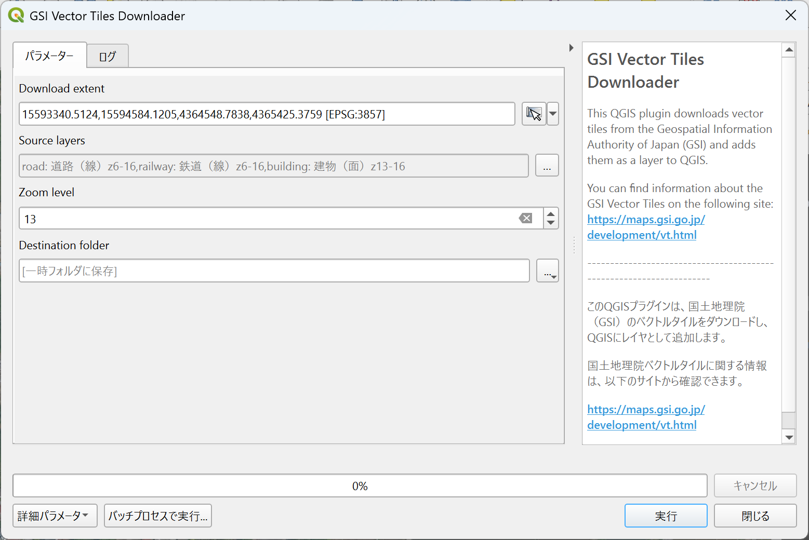

# GSI Vector Tiles Downloader

[English](#Overview) / [日本語](#概要)

## Overview

- This QGIS plugin downloads vector tiles from the Geospatial Information Authority of Japan (GSI) and adds them as a layer to QGIS.
- You can find information about the GSI Vector Tiles on the following site: https://maps.gsi.go.jp/development/vt.html

## Usage

- Click this icon on the QGIS plugin tool bar.

- You can also find it in the Processing Toolbox -> GSI vector tiles downloader.
- Set the following parameters:

  - (1) Download extent (By clicking the cursor icon on the right, the current map canvas extent will be selected)
  - (2) Source Layers
  - (3) Zoom level
  - (4) Output folder (if not specified, output will be loaded as temporary layers)

- Click Run.

## 概要

- この QGIS プラグインは、国土地理院（GSI）のベクトルタイルをダウンロードし、QGIS にレイヤとして追加します。
- 国土地理院ベクトルタイルに関する情報は[ こちら ](https://maps.gsi.go.jp/development/vt.html)から確認できます。

## 使い方

- QGIS のツールバーにあるこのアイコンをクリックします。

  

- ［プロセッシングツールボックス］->［GSI vector tiles downloader］　でも探すことができます。
- 以下の情報を入力して、目的のベクトルタイルを選択します。

  - (1) ダウンロード範囲

    - 右側のカーソルアイコンをクリックすると、現在のマップキャンバスの範囲が選択されます。

  - (2) ソースレイヤ
    - [...]ボタンをクリックし、対象項目を選択
 
  - (3) ズームレベル
  - (4) 出力フォルダ
    - 指定しない場合、一次レイヤとして出力

- ［実行］をクリックします。

## Authors

- Updated successor to [GSI-VTDownloader](https://github.com/Kanahiro/GSI-VTDownloader).
- MIERUNE Inc.
